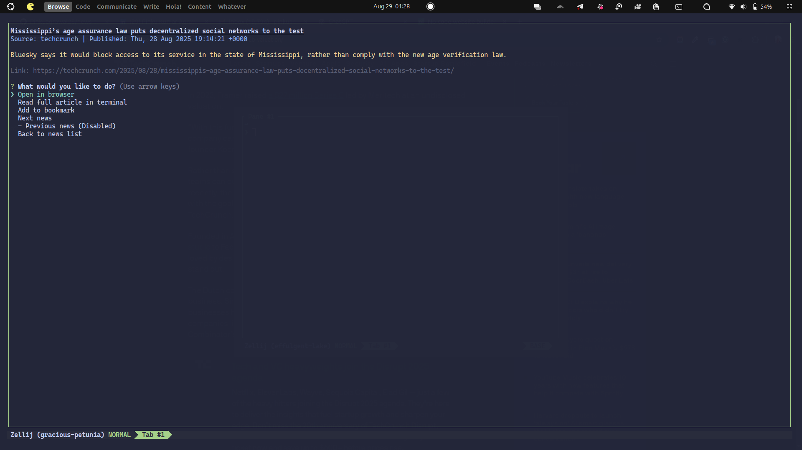

# Visual Demo

This section provides a visual overview of the Tech News CLI in action.

## Main Menu

*The main interactive menu of the CLI.*

## Selecting Sources

*Choosing which news sources to fetch articles from.*

## Displaying Headlines

*A list of fetched headlines from selected sources.*

## Reading an Article

*Reading a full article directly within the terminal.*

## Article Options

*Options available after reading an article, such as bookmarking or opening in browser.*

## Bookmarking an Article

*Confirming an article has been bookmarked.*

## Listing Bookmarks

*Viewing the list of saved bookmarks.*